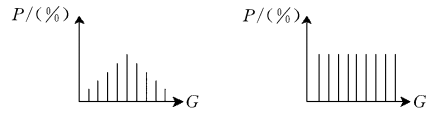

# 直方图均衡化

直方图均衡化的目的是强化图片。基本思想是非线性的拉伸像素的分布，使得像素的灰度在0-255的空间内分布的更加均匀。这样做可以增强图像的对比度。下图展示了灰度直方图的变化。

## 原理

首先将0-255划分为L个区间作为灰度级，统计落在每个区间的像素个数，产生直方图。令n为整张图像像素数量总和，nj为落在第j个直方图的像素数量，sk为第k个直方图的累积概率。根据下图进行计算

将每个像素点按照其对于的灰度级乘以sk，就得到新的图像。

## 效果

## 参考

[直方图均衡化原理](https://www.cnblogs.com/tianyalu/p/5687782.html)
[直方图均衡化原理与实现](https://www.cnblogs.com/hustlx/p/5245461.html)
