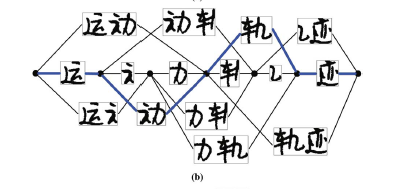
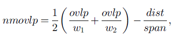

# Note of Improving handwritten Chinese text recognition using neural network language models and convolutional neural network shape models（In: Pattern Recognition 2017）

## 概述和系统总览
目前的中文手写字符识别系统大概有四个组件：字符分类器（character classifier），过分割（over segmentation），几何上下文模型（geometric context model），语言模型（language model）组成。本文把这些组件从传统方法全换成了深度学习方法，观测到了明显的性能提高。

系统的大致构成如下图，我们接受内容为一行字符的图片。图片的预处理和行分割是预先做好的。

首先使用CCA（Connected Component Analysis）和TPS（Touching Pattern Splitting），图片将被过度分割。这一步将图片分割为一个字符或一个字符的一部分。如下图。

之后，一个或多个连续的分割会组合生成候选字符模式（candidate character pattern）。所有可能的组合会形成一个候选分割格（segmentation candidate lattice）。其中的每一条路径称为候选分割路径（candidate segmentation path）。如下图所示。

之后格中的每一个候选字符模式被一个字符分类器分类，并被赋予多个类标。一条候选分割路径上的所有候选字符模式将生成一个候选字符格（character candidate lattice）。此格中的每条路径包含一个字符序列和一个候选字符模式序列。这种路径被称为候选分割识别路径(candidate segmentation-recognition path)。如下图所示。

之后我们的任务就是混合多种上下文建模，找出可能性最大的一条路径。

## 过分割技术CCA和TPS
这一部分来自另一篇文章[1].Lexicon-driven segmentation and recognition of handwritten character strings for Japanese address reading

在进行分割任务之前，图像会先去噪处理。

### 合并联通区

首先进行联通区分析。就横向书写而言，将联通区分隔开后，投影到x轴有重叠的，并且相邻的部分可能是同一个字符。我们计算不同联通区的横向重叠度如下式。符号的定义见论文[1]第1428页左侧。

档nmovlp大于0，则合并两个元素。直观的解释公式3：第一项使用联通区宽度归一化重叠区域长度，并求平均，可以认为是重叠度，第二项用两者总共的宽度归一化两者的质心距离。当重叠度度量大于宽度度量时，认为两个联通区属于同一字符。这一过程会递归的不断合并符合条件的相邻联通区。

### 检测粘连模式（touching pattern）

我们将合并联通区得到的图像称作图像分割（image segment）。在合并联通区后，我们检测两个字粘连在一起的笔画，从而将两个字分开。首先我们估计字的高度。做法是统计图像分割的高度直方图并求平均。相邻的图像分割会被暂时合并以增加高度信息的可靠程度。

之后，宽度足够的分割会被判定为潜在的关联模式。找出单笔画的部分（在垂直于书写方向的方向只有一个笔画，同时这一笔画在垂直于书写方向的方向不能太长）。对照下图所示的模式，能够对应的部分会在箭头指向的部分被垂直的切开。

### 强制分割

多笔画区域过宽的部分会被强制分割。

中间空白较宽的两个区域在下一步合并的时候会被禁止合并。
